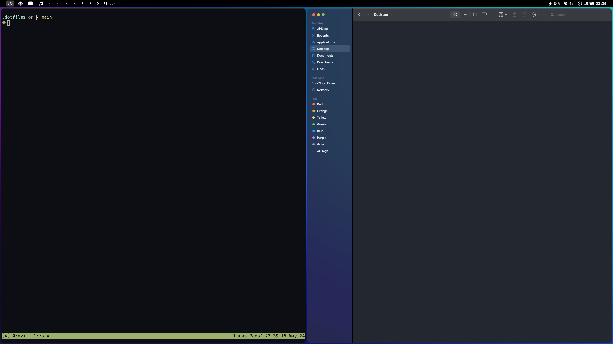

# .dotfiles
This repo contains my personal dotfiles. Here's how my setup looks on MacOS:



## Motivation
My main motivation when creating this repo was having to keep things in sync between multiple workstations (Linux desktop, Linux laptop, MacOS laptop), since having to reconfigure the same things over and over again in different computers was getting tiresome.

## Features
My dotfiles have some interesting features:
- Machine-specific environment via `.zshenv`
- OS-specific ZSH configuration
- OS-specific installation methods
- Manage multiple versions of the same tool with [`asdf-vm`](https://asdf-vm.com/)
- Global installation of language packages (Rust, Golang, Python)
- Simplified tmux/neovim/i3 config to make shortcuts as similar as possible for similar functionality, just with different trigger keys.

## Installation
To install the dotfiles, run
```
git clone git@github.com:serramatutu/dotfiles.git ~/.dotfiles
bash bootstrap.sh
```
The bootstrap script is idempotent and is safe to run multiple times, so don't worry :)

**NOTE:** a fresh install from scratch might take a while to complete, since a lot of things are built from source. This is on purpose to avoid small bugs and issues with tools such as `python` and `rust-analyzer`.

## How the bootstrap script works
The repo is divided into a few directories. Each of them might contain a `bootstrap.sh` script which is responsible for installing whatever is in that directory into the current environment. The environment is installed in the following order:
1. Initialize Git submodules, such as ZSH themes and plugins, which are managed by Git
2. Initialize OS-specific configuration:
  - MacOS: Install Homebrew via `packages/homebrew/bootstrap.sh`
  - Linux: Install all `apt` packages via `packages/apt/bootstrap.sh`
3. Initialize ZSH 
4. Initialize `asdf`
5. Initialize language-managed packages (cargo, pip, golang etc)
6. Symlink directories in `.config` to `~/.config`
7. Symlink everything in `home` to `~/`

## Making changes 

### Adding a new managed configuration
To add a new program config in `~/.config` to the managed configs, just run
```
mv ~/.config/new_program $DOTFILES/.config/new_program
ln -sf $DOTFILES/.config/* ~/.config/
```

To add a new home folder file to `home`, follow the same process but using `~/` instead.

### Configuring OS-specific things in ZSH
OS-specific macros, aliases and other things should be added to `os/<os>/zshload.zsh`. The `.zshrc` file will automatically load the correct file depending on which OS you are running on.

### Avoid committing sensitive environment variables
In order to avoid committing any sensitive information, the `.zshrc` file sources `~/.zshenv`, which contains machine-specific environment variables which are not supposed to be in git. If you need to add any credentials or sensitive variables, add it to `~/.zshenv` instead of `.zshrc`.

